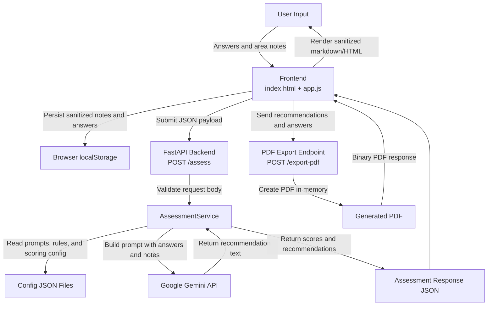

# Data Flow Diagram

This diagram shows how user-supplied data and LLM output move through the application.

## Data Elements

- Assessment answers
- Area notes entered by the business owner
- Derived scoring and tier calculations
- AI-generated recommendations
- PDF export payload

## Mermaid Diagram

## Trust Boundaries

- Boundary 1: Browser to backend
  User-controlled data enters the system through `answers` and `area_notes`.
- Boundary 2: Backend to third-party AI provider
  Prompt content built from user responses is sent to Google Gemini.
- Boundary 3: LLM output back into the browser
  Recommendation text is rendered in the frontend and must be sanitized before HTML insertion.

## Current Implementation References

- Frontend submission flow: [app.js](/Users/devanshijain/SBDC/app.js:659)
- Local persistence: [app.js](/Users/devanshijain/SBDC/app.js:81)
- Backend assessment endpoint: [main.py](/Users/devanshijain/SBDC/main.py:41)
- Gemini integration: [services.py](/Users/devanshijain/SBDC/services.py:36)
- PDF export endpoint: [main.py](/Users/devanshijain/SBDC/main.py:74)
