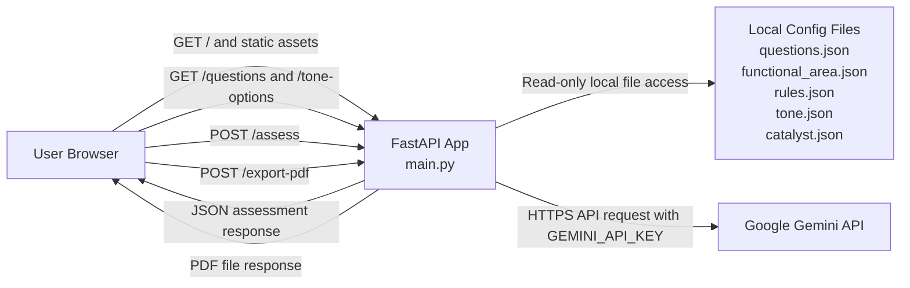

# Network Diagram

This diagram documents the runtime network interactions for the SBDC Business Assessment Tool as implemented in this repository.

## Scope

- Frontend served by the FastAPI application
- Backend API hosted as a single FastAPI service
- Outbound AI request to Google Gemini
- No database or queue is used in the current implementation

## Mermaid Diagram

## Notes For Review

- The browser sends assessment answers and area notes to `POST /assess`.
- The backend sends prompt content derived from those answers and notes to Google Gemini.
- The backend returns generated recommendations to the browser.
- The browser can then send recommendations plus answer metadata to `POST /export-pdf` for PDF generation.
- The current CORS configuration in [main.py](/Users/devanshijain/SBDC/main.py:18) allows all origins.
- The only required secret currently identified in code is `GEMINI_API_KEY` from [services.py](/Users/devanshijain/SBDC/services.py:36).
